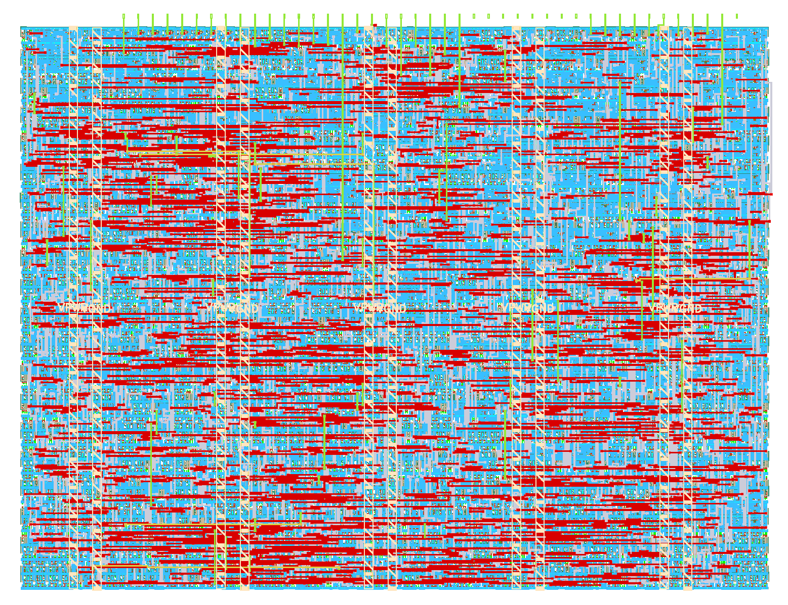
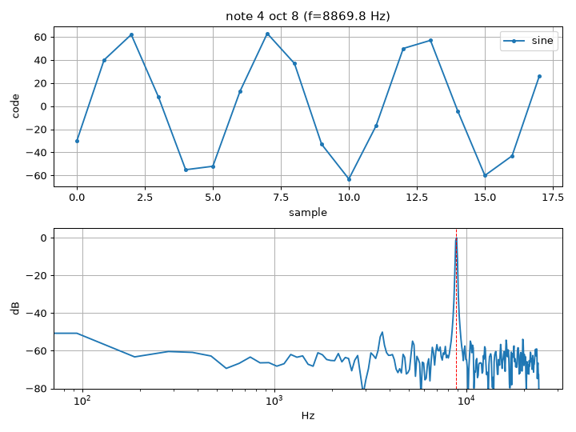
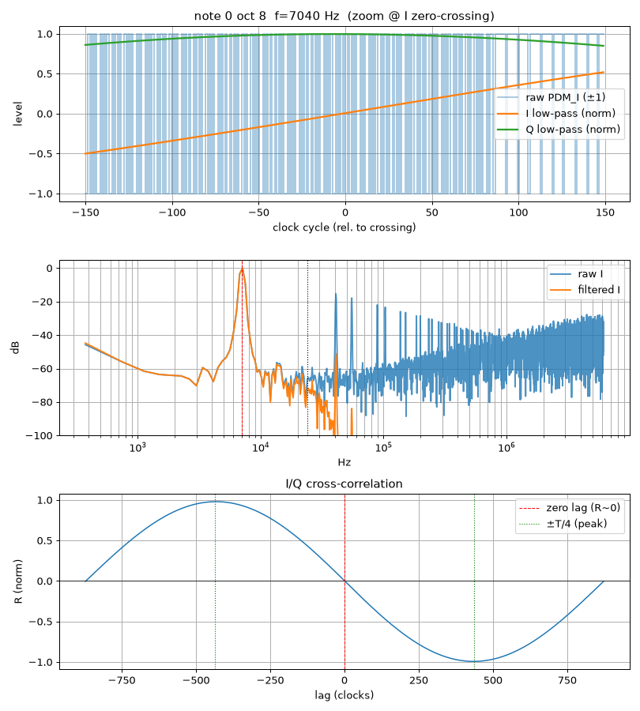

<!---
This file is used to generate your project datasheet. Please fill in the information below and delete any unused
sections. Images live in this folder; each must be < 512 kB and all together < 1 MB.
-->

## How it works

`tt_um_abeccari_swsynth` is a **CORDIC sine-wave synthesizer**: it plays an equal-tempered musical note as an audio tone. You choose the pitch on the input pins, and the tone comes out three ways — a parallel digital sample bus and two 1-bit pulse-density-modulated (PDM) streams.

Signal chain:

1. **Note select** — `ui[3:0]` picks a semitone (see the table below) and `ui[7:4]` an octave above A0 = 27.5 Hz. The output frequency is `f = 27.5 · 2^(note/12) · 2^octave` Hz, with the octave clamped to ≤ 8 so the tone stays below the Nyquist rate.
2. **NCO** — a frequency map turns the note into a phase increment that drives a 20-bit phase accumulator, stepped at the 48 kHz sample rate (`clk / 256`).
3. **CORDIC** — a rotation-mode CORDIC converts the phase into signed sine and cosine samples (~8-bit accurate).
4. **Outputs** —
   - `uo[6:0]` — **7-bit parallel sine**, offset-binary (`0x40` = zero crossing), refreshed once per 48 kHz sample. `uio[0]` (**SAMPLE_EN**) pulses high for one clock at each new sample.
   - `uo[7]` — **PDM_I**, a 1-bit sigma-delta stream of the sine at the full clock rate; low-pass filtered, it reconstructs the analog sine.
   - `uio[7]` — **PDM_Q**, the same for the cosine (90° out of phase with PDM_I) — an I/Q pair.
   - `uio[6]` — **SQR**, a 1-bit square wave at the tone frequency (the sign of the sine); a clean digital output that needs no filter.
   - `uio[5]` — **SAW**, a 1-bit sigma-delta sawtooth at the tone frequency (the raw phase ramp); low-pass filter to reconstruct.
   - `uio[4]` — **NOISE**, a 1-bit pseudo-random bitstream from a maximal-length 20-bit LFSR, advanced one step per 48 kHz sample. Its spectrum is flat across the audio band (white noise); low-pass filter to hear it. The sequence is deterministic and repeats every 2²⁰−1 samples (≈ 21.8 s).

Semitone codes on `ui[3:0]` (codes 12–15 have no distinct note and fold back to A):

| `ui[3:0]` | 0 | 1  | 2 | 3 | 4  | 5 | 6  | 7 | 8 | 9  | 10 | 11 | 12–15 |
|-----------|---|----|---|---|----|---|----|---|---|----|----|----|-------|
| Note      | A | A# | B | C | C# | D | D# | E | F | F# | G  | G# | A     |

The clock is 12.288 MHz = 256 × 48 kHz.

## How to test

1. **Clock** — drive `clk` at the 12.288 MHz design point; the pitch and 48 kHz sample rate scale with it (`f_s = clk / 256`), and being fully synchronous it also runs correctly at lower rates. Clocks up to ~60 MHz are within the process corners (worst-case Fmax ≈ 66 MHz at the slow corner, from signoff STA); the demo board's on-board clock tops out at 50 MHz, which the design meets with margin, so drive `clk` externally to go higher.
2. **Reset** — hold `rst_n` low for a few clock cycles, then release it high.
3. **Pick a note** — set `ui[7:4]` = octave and `ui[3:0]` = semitone. For example `ui_in = 0x40` → octave 4, note 0 (A) → **440 Hz** (concert A); `ui_in = 0x80` → note A, octave 8 → 7040 Hz.
4. **Monitor** —
   - Put a logic analyzer on `uo[6:0]` (the 7-bit sine) and use `uio[0]` (SAMPLE_EN, 48 kHz) as the sample clock / scope trigger. The value traces a sine centered on `0x40`.
   - Scope `uo[7]` (PDM_I) and `uio[7]` (PDM_Q): fast 1-bit streams whose pulse density follows the sine and cosine.
5. **Change the note** on `ui_in` at any time; the tone follows on the next samples.

## External hardware

On the **TinyTapeout demo board** the on-board RP2040 selects the design, supplies the clock, drives `ui_in`, and reads the outputs — so you can set the note from the on-board DIP switches or a MicroPython script and capture the 48 kHz parallel-sine samples in software, with no extra parts. All I/O is also broken out on the Pmod and SIL headers for the analog add-ons below.

- **Hear it:** low-pass filter `uo[7]` (PDM_I) with a simple RC and drive a powered speaker or amplifier. The **Audio Pmod** does exactly this (RC reconstruction filter + amplifier + jack) and takes its input on `uo[7]`, so it plugs straight into the output Pmod.
- **Quadrature (I/Q):** filter `uio[7]` (PDM_Q) the same way for a second channel 90° out of phase — useful for demodulation experiments.
- **Parallel DAC:** feed `uo[6:0]` (offset-binary, midscale `0x40`) into a 7-bit R-2R resistor-ladder DAC on the output Pmod or a SIL header, latched by SAMPLE_EN (`uio[0]`), for an analog staircase sine; add a gentle RC afterward to smooth the sampling images.

